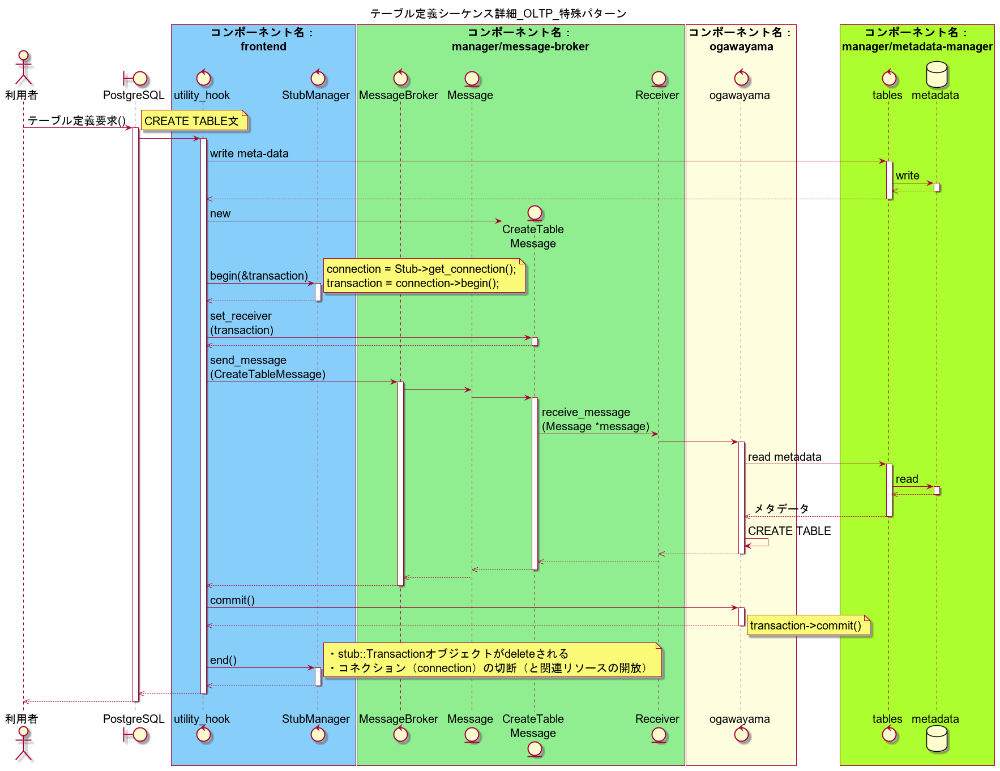
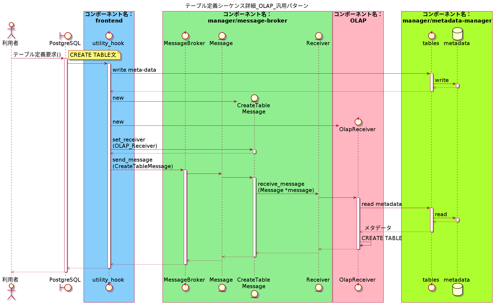

# frontend V2 テーブル定義機能 technical design
2020.07.31 NEC 

## 目次
<!-- @import "[TOC]" {cmd="toc" depthFrom=1 depthTo=6 orderedList=false} -->

<!-- code_chunk_output -->

- [デザインパターン](#デザインパターン)
- [クラス図](#クラス図)
- [シーケンス図](#シーケンス図)
  - [概要](#概要)
  - [詳細](#詳細)
- [エラー処理](#エラー処理)
  - [処理フロー](#処理フロー)
  - [メッセージ方式](#メッセージ方式)
  - [エラーコード一覧](#エラーコード一覧)
- [コーディング規約](#コーディング規約)
- [詳細設計書](#詳細設計書)
- [Appendix. シーケンス図の疑似コード](#appendix-シーケンス図の疑似コード)
- [Appendix. DEFAULT制約](#appendix-default制約)
  - [V2で実装しない理由](#v2で実装しない理由)
  - [将来バージョンでのDEFAULT制約格納方式案](#将来バージョンでのdefault制約格納方式案)

<!-- /code_chunk_output -->

## デザインパターン
* デザインパターンのCommandパターンを採用する。
* Commandパターンに関するクラスはmanager/messageで管理する。

## クラス図
* クラス図の詳細説明は、次のドキュメントを参照する。
  * https://github.com/project-tsurugi/manager/blob/develop/message-broker/docs/message-broker_API.md

    

## シーケンス図
### 概要


### 詳細
* OLTP 特殊パターン
  * Stub::TransactionクラスがReceiverクラスを継承する。
  

* OLAP 汎用パターン
  

* メリット
  * ogawayama用のMessageクラスを作る必要がなく、構造化できている。
  * ogawayamaリポジトリに、Receiverクラスの具象クラスを置くことができる。
  * 調査不足だが、1つのトランザクションで複数メッセージを処理できるように見える。
  * 実装がシンプル
* デメリット
  * 特に思いつかない。

* 採用理由
  * 本案はメリットが多く、他の案はデメリットが多い。具体的には、他の案では、下記のデメリットがある。
    * ogawayama用のMessageクラスを作成しなければいけない。
    * void*型に安全にオブジェクトのポインタを渡せるのかが不明。
    * 1つのトランザクションで1つのメッセージしか処理できない。
    * frontendリポジトリに、Receiverクラスの具象クラスを置く必要がある。

## エラー処理

### 処理フロー
* エラー処理のフローを次に示す。
1. PostgreSQLはエラーを検出し、エラーメッセージを出力する。2.以降は実行されない。
2. PostgreSQLは、frontendにテーブル定義要求を送信する。
3. frontendは、Tsurugiでサポートしない構文・型をチェックしてエラーメッセージを出力する。4.以降は実行されない。
4. frontendは、metadata-managerに実テーブル定義要求を送信する。
5. frontendは、metadata-managerから戻り値でエラーを受け取って、エラーメッセージを出力する。6.以降は実行されない。
6. frontendは、ogawayamaにテーブル定義要求を送信する。
7. frontendは、ogawayamaから戻り値でエラーを受け取って、エラーメッセージを出力する。

### メッセージ方式
* エラーメッセージを出力する場合、PostgreSQLのライブラリereport関数を利用する。
    * エラーレベルはERRORとする。
    * 例:(errcode(ERRCODE_FEATURE_NOT_SUPPORTED),
         errmsg("Tsurugi does not support type %s", nodeToString(type_names))));
* 標準エラー出力・ログ出力については、PostgreSQLの仕様と同じとなる。

### エラーコード一覧
|エラーコード|説明|
|---|---|
|ERRCODE_SYNTAX_ERROR|構文エラー|
|ERRCODE_FEATURE_NOT_SUPPORTED|サポートしない機能|
|ERRCODE_INTERNAL_ERROR|Tsurugiの内部エラー|
|ERRCODE_DUPLICATE_TABLE|テーブル名の重複|
|ERRCODE_DUPLICATE_COLUMN|カラム名の重複|

## コーディング規約
* PostgreSQLのコーディング規約に従う。
    * PostgreSQLコーディング規約  
    https://www.postgresql.jp/document/11/html/source.html
    * PostgreSQLのコーディングスタイル  
    http://www.nminoru.jp/~nminoru/postgresql/pg-coding-style.html

## 詳細設計書
* ソースコード中にコメントを記載し、doxygenで生成する。

## Appendix. シーケンス図の疑似コード
  * manager/message-broker/include/message_broker.h
  ~~~C++
  // Receiverインタフェースクラス
  class Receiver {
    virtual void receive_message(Message* message) = 0;
  };
  
  // Message IDリスト
  enum {
    CREATE_TABLE,
    ALTER_TABLE,
    DROP_TABLE
    ...
  } MESSAGE_ID;
  
  // Messageインタフェースクラス
  class Message {
    MESSAGE_ID id;                
    int object_id;                // メタデータ群を一意に指定するID
    vector<Receiver> receivers;   // メッセージ送信先
  public:
    void set_receiver(Receiver* receiver_) {receivers.push_back(receiver);}}
  };
  
  // Message派生クラス
  class CreateTableMessage : Message {
    CreateTableMessage(uint64_t object_id){
        id = CREATE_TABLE;
    }
  };
  
  class MessageBroker {
    void send_message(Message* message)
    {
      for (auto& receiver : message->receivers) {
        receiver.receive_message(message);
      }
    }
  };
  ~~~
  
  * frontend/alt_utility/create_table.cpp
  
  ~~~C++
  
  #include "manager/message-broker/message_broker.h"
  #include "ogawayama/stub/api.h"
  #include "stub_manager.h"
  
  MessageBroker broker;
  CreateTableMessage ct_message{object_id};
  
  stub::Transaction* transaction;
  StubManager::begin(&transaction);
  ct_message->set_receiver(transaction);
  broker.send_command(ct_message);
  transaction->commit();
  StubManager::end();
  
  ~~~
  
  * ogawayama/stub/api.h stub::Transactionクラス (Receiver派生クラス）
  ~~~C++
  #include "manager/message-broker/message_broker.h"
  
  // Receiver派生クラス
  class Transaction : Receiver {
    ...
    void receive_message(Message* message) {
    
      switch(message->id) 
      {
        case CREATE_TABLE:
            execute_statement( ... ); // ogawayama-serverにテーブル定義メッセージを送信
            break;
        case ALTER_TABLE:
              ...
      }
    }
    ...
  };
  ~~~

## Appendix. DEFAULT制約
* 将来バージョンでの実装とする。

### V2で実装しない理由
* 優先度は低い。また、ogawayama_fdwを改造する必要があり、計画スケジュールに収まらないため。ogawayama_fdwで、INSERT/UPDATE/DELETE時に、カラムの値をDEFAULT値に変換する処理が必要である。

### 将来バージョンでのDEFAULT制約格納方式案
* DEFAULT制約が指定された場合、metadata-managerのtables.jsonにシステムカタログテーブルpg_attrdefのカラム名adbin、adsrcと同様の形式で格納  
    * システムカタログテーブルpg_attrdef  
    https://www.postgresql.jp/document/11/html/catalog-pg-attrdef.html
    * 例
    ~~~sql
    postgres=# select adbin, pg_get_expr(d.adbin, d.adrelid) as adsrc from pg_attrdef d;

                                 adbin
                                                                    |                   adsrc
    ---------------------------------------------------------------------------------------------------------------------------------------------------------------------------------------------
    ---------------------------------------------------------------------------------------------------------------------------------------------------------------------------------------------
    ----------------------------------------------------------------+-------------------------------------------
    {FUNCEXPR :funcid 480 :funcresulttype 23 :funcretset false :funcvariadic false :funcformat 2 :funccollid 0 :inputcollid 0 :args ({FUNCEXPR :funcid 1574 :funcresulttype 20 :funcretset false
    :funcvariadic false :funcformat 0 :funccollid 0 :inputcollid 0 :args ({CONST :consttype 2205 :consttypmod -1 :constcollid 0 :constlen 4 :constbyval true :constisnull false :location -1 :co
    nstvalue 4 [ 22 64 0 0 0 0 0 0 ]}) :location -1}) :location -1} | nextval('foreign_table_id_seq'::regclass)
    {FUNCEXPR :funcid 2027 :funcresulttype 1114 :funcretset false :funcvariadic false :funcformat 2 :funccollid 0 :inputcollid 0 :args ({SQLVALUEFUNCTION :op 3 :type 1184 :typmod -1 :location
    92}) :location -1}
                                                                | CURRENT_TIMESTAMP
    (2 rows)
    ~~~

    * jsonで次の形式で格納
        ```
            // Columnメタデータオブジェクト
            {
                ...,
                "nullable"          : bool,                                    [*] // NOT NULL制約の有無
                "default"           : { "adbin" : string, "adsrc" : string },  [+] // デフォルト式
                "direction"         : number                                   [+] // 方向（0: DEFAULT, 1: ASCENDANT, 2: DESCENDANT）
            }
        ```
    * adbin：nodeToString形式だが、PostgreSQLが理解しやすいため格納
    * adsrc：PostgreSQL 12から削除されたカラム名だが、human readableであり、nodeToString形式から変換処理が不要となるため格納。


* DEFAULT制約が指定されなかった場合、metadata-managerのtables.jsonにkeyを作成しない。

* DEFAULT制約が指定された場合、ProcessUtility_hookでadbin、adsrcを取得するコード

alt_utility.c tsurugi_ProcessUtilitySlow関数 に追記するコード（抜粋）
~~~C
                if (IsA(stmt, CreateStmt))
                {
                    Datum toast_options;
                    static char *validnsps[] = HEAP_RELOPT_NAMESPACES;

                    /* Create the table itself */
                    address = DefineRelation((CreateStmt *)stmt,
                                             RELKIND_RELATION,
                                             InvalidOid, NULL,
                                             queryString);
                    EventTriggerCollectSimpleCommand(address,
                                                     secondaryObject,
                                                     stmt);

                    CreateStmt *create_stmt = (CreateStmt *)stmt;
                    List *table_elts_list = create_stmt->tableElts;
                    ListCell *table_elts;

                    TupleDesc descriptor = BuildDescForRelation(table_elts_list);
                    int attnum = 0;

                    ParseState *pstate;
                    pstate = make_parsestate(NULL);

                    foreach (table_elts, table_elts_list)
                    {
                        attnum++;
                        ColumnDef *colDef = (ColumnDef *)lfirst(table_elts);

                        if (colDef->raw_default != NULL)
                        {
                            char *f;
                            char *adsrc;
                            char *adbin;

                            Form_pg_attribute atp = TupleDescAttr(descriptor, attnum - 1);

                            Node *expr_cooked = cookDefault(pstate, colDef->raw_default,
                                               atp->atttypid, atp->atttypmod,
                                               NameStr(atp->attname));

                            adbin = nodeToString(expr_cooked);

                            Relation rel = relation_open(address.objectId, AccessExclusiveLock);
                            adsrc = deparse_expression(expr_cooked,
                                                       deparse_context_for(RelationGetRelationName(rel),
                                                                           RelationGetRelid(rel)),
                                                       false, false);

                            relation_close(rel, NoLock);

                            f = pretty_format_node_dump(nodeToString(colDef->raw_default));
                            printf("nodeToString: %s\n", f);
                            printf("adsrc: %s\n", adsrc);
                            fflush(stdout);
                            pfree(f);
                            pfree(adsrc);
                            pfree(adbin);
                        }
                    }
~~~

以上
