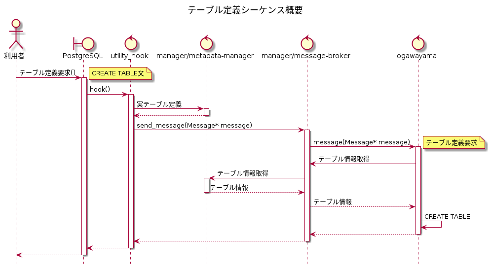
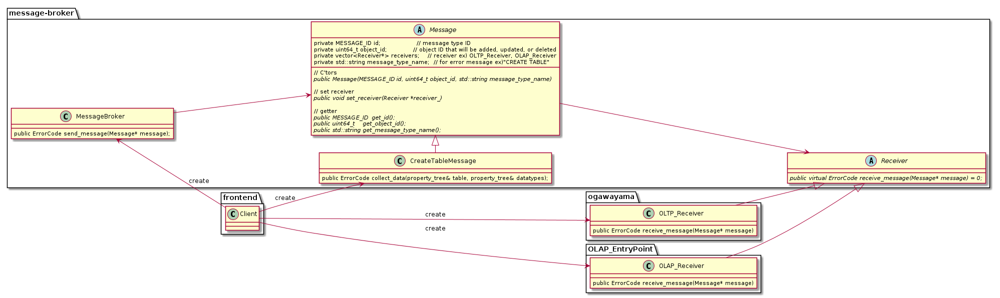
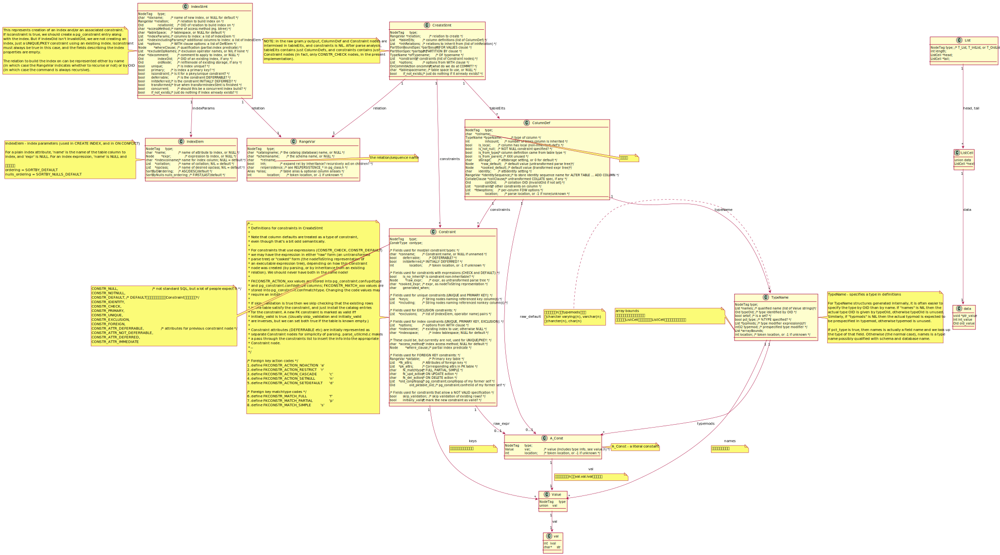
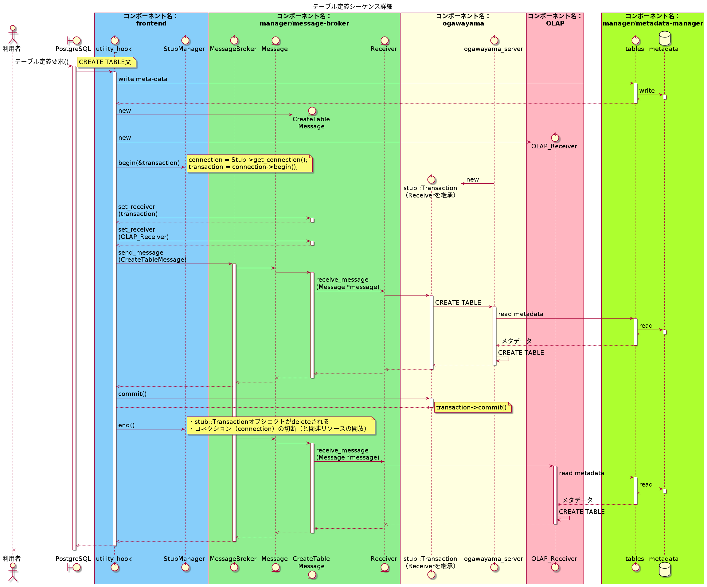

# frontend V2 テーブル定義機能設計書 {ignore=True}
2020.05.29 NEC 

★は要検討・他コンポーネントとの調整項目

## 目次 {ignore=True}
<!-- @import "[TOC]" {cmd="toc" depthFrom=1 depthTo=6 orderedList=false} -->

<!-- code_chunk_output -->

- [開発の目的](#開発の目的)
- [基本方針](#基本方針)
- [構文・型](#構文型)
  - [サポートするCREATE TABLE構文](#サポートするcreate-table構文)
  - [サポートする型](#サポートする型)
  - [サポートするロケール](#サポートするロケール)
  - [構文例](#構文例)
- [テーブル定義機能シーケンス](#テーブル定義機能シーケンス)
  - [シーケンス概要](#シーケンス概要)
    - [シーケンス図](#シーケンス図)
    - [Commandクラス](#commandクラス)
    - [図中のmessage(Command command)](#図中のmessagecommand-command)
    - [metadata-managerに格納する値一覧](#metadata-managerに格納する値一覧)
      - [データベース名](#データベース名)
      - [スキーマ名](#スキーマ名)
      - [Tableメタデータ(root)](#tableメタデータroot)
      - [Tableメタデータオブジェクト](#tableメタデータオブジェクト)
      - [Columnメタデータオブジェクト](#columnメタデータオブジェクト)
        - [PostgreSQLとカラムのデータ型のID対応表](#postgresqlとカラムのデータ型のid対応表)
      - [DataTypeメタデータ(root)](#datatypeメタデータroot)
        - [DataTypeメタデータオブジェクト](#datatypeメタデータオブジェクト)
        - [データ型ID一覧](#データ型id一覧)
    - [CreateStmt・IndexStmtクエリツリーのクラス図](#createstmtindexstmtクエリツリーのクラス図)
  - [シーケンス詳細](#シーケンス詳細)
    - [シーケンス図](#シーケンス図-1)
- [エラー処理](#エラー処理)
  - [基本方針](#基本方針-1)
  - [処理フロー](#処理フロー)
  - [メッセージ方式](#メッセージ方式)
  - [メッセージ内容](#メッセージ内容)
    - [構文エラー](#構文エラー)
    - [型エラー](#型エラー)
- [metadata-managerの改造](#metadata-managerの改造)
  - [改造項目](#改造項目)
    - [1. データ型に関するメタデータの変更](#1-データ型に関するメタデータの変更)
    - [2. エラー処理の追加](#2-エラー処理の追加)
    - [3. メタデータの格納先を固定](#3-メタデータの格納先を固定)
    - [4. DebugビルドとReleaseビルドを分ける](#4-debugビルドとreleaseビルドを分ける)
  - [データ型に関するメタデータを追加する理由](#データ型に関するメタデータを追加する理由)
- [コーディング規約](#コーディング規約)
- [詳細設計書](#詳細設計書)
- [Appendix. DEFAULT制約](#appendix-default制約)
  - [V2で実装しない理由](#v2で実装しない理由)
  - [将来バージョンでのDEFAULT制約格納方式案](#将来バージョンでのdefault制約格納方式案)

<!-- /code_chunk_output -->


## 開発の目的

* 2020年4月8日ノーチラス・テクノロジーズ様との打ち合わせから抜粋
    * テキストベースの受け渡しは、PostgreSQLとTsurugiの仕様の相違を吸収しにくい。
    * 今後ALTERコマンド等に対応をしていくことを考えると、もう少しシステマチックで拡張性のある方式を検討したい。
        * V1ではデータ型名を正規表現で置換する方法でクエリーを書き換えている。

## 基本方針
* frontend V2の機能は、V1の機能と同じとして、シーケンスの変更およびエラー処理の追加を実施する。
* metadata-managerを改造する。[metadata-managerの改造](#metadata-managerの改造)を参照。
* PostgreSQL互換

* 将来verで検討する機能項目一覧 ★要検討

|将来verで検討する機能項目|V2での実装方針|将来verでの方針|優先度|
|----|----|----|----|
|[サポートする型](#サポートする型)以外の型|エラーメッセージを出力。<br>テーブル定義されない。<br>date、配列がお客様に利用されるため、拡張性ある実装とする。|date、配列の利用あり|高|
|列制約のNOT NULL・PRIMARY KEY制約、および表制約のPRIMARY KEY制約（複合主キー含む）以外の制約|エラーメッセージを出力。<br>テーブル定義されない。|外部キー制約など性能測定に必要であるため優先？|中|
|スキーマ名|frontendは、PostgreSQLでスキーマ名が入力されても、構文エラーとしないが、<br>スキーマ名はmetadata-managerに格納されない。<br>つまり、スキーマ名の入力は無視して処理する。|性能測定が優先であるため、ユーザー管理機能で検討？|中|
|インデックスの方向(DEFAULT,ASC,DSC)|V1と同様に全カラムに対して常に **"0"** を格納 <br> ★ノーチラス・テクノロジーズ様に確認||中|
|DEFAULT制約の式の格納|V1と同様に全カラムに対して常に **"(undefined)"** を格納 <br> ※V1.0ではDEFAULT制約を指定しない場合、常に"(undefined)"で格納されている <br> ★ノーチラス・テクノロジーズ様に確認||低|
|[サポートするロケール](#サポートするロケール)以外のロケール|エラーハンドリングしない<br>注意事項として提示||低|
|データ形式フォーマットバージョン、メタデータの世代|"1"固定||低|


## 構文・型
### サポートするCREATE TABLE構文

CREATE TABLE *table_name* ( [  
&nbsp;&nbsp;{ *column_name* *data_type* [ *column_constraint* [ ... ] ]  
&nbsp;&nbsp;&nbsp;&nbsp;| *table_constraint* }  
&nbsp;&nbsp;&nbsp;&nbsp;[, ... ]
] )  
TABLESPACE tsurugi

*column_constraint*には、次の構文が入る。  

[ CONSTRAINT *constraint_name* ]  
{ NOT NULL |   
&nbsp;&nbsp;PRIMARY KEY }  

また、*table_constraint*には、次の構文が入る。 

[ CONSTRAINT *constraint_name* ]  
{ PRIMARY KEY ( *column_name* [, ... ] ) }  

### サポートする型

|大分類|PostgreSQLの型(名)|PostgreSQLの型(別名)|ogawayamaの型（名）|
|-:|:-|:-|:-|
|整数|smallint|int2|INT16|
|整数|integer|int, int4|INT32|
|整数|bigint|int8|INT64|
|浮動小数点|real|float4|FLOAT32|
|浮動小数点|double precision|float8|FLOAT64|
|文字列|text||TEXT|
|文字列|character [ (n) ]|char [ (n) ]|TEXT|
|文字列|character varying [ (n) ]|varchar [ (n) ]|TEXT|

### サポートするロケール

* 現時点ではPostgreSQLに準拠する方向で検討。★ノーチラス・テクノロジーズ様に実行エンジンの仕様を確認

|項目|値|
|----|----|
|照合順序(LC_COLLATE) |C|
|文字の種類(LC_CTYPE)|C|
|エンコーディング(ENCODING)|UTF8|

### 構文例

* filmsテーブルを作成します。
    * 列制約にPRIMARY KEY制約
    ~~~sql
    CREATE TABLE films (
        code        char(5) CONSTRAINT firstkey PRIMARY KEY,
        title       varchar(40) NOT NULL,
        did         integer NOT NULL,
        kind        varchar(10),
    ) tablespace tsurugi;
    ~~~
    * 表制約にPRIMARY KEY制約
    ~~~sql
    CREATE TABLE films (
        code        char(5),
        title       varchar(40),
        did         integer NOT NULL,
        kind        varchar(10),
    PRIMARY KEY (code, title) ) tablespace tsurugi;
    ~~~

## テーブル定義機能シーケンス

### シーケンス概要

#### シーケンス図


#### Commandクラス


#### 図中のmessage(Command command)
* デザインパターンについて
    * V1では、Builderパターンを使用されていると認識している。
        * Builderパターン  
        https://www.techscore.com/tech/DesignPattern/Builder.html/    
    * V2では、ogawayamaへのパラメーターの渡し方は、次のように、Builderパターンの中で、Commandクラスを渡してもよいか。★ノーチラス・テクノロジーズ様に確認
        * こうすることで、ogawayamaと通信するコード量が減るため。
        * パラーメーターの渡し方例

    ~~~C
        CreateTableCommand command{id,name,table_id} //今回追加するCommandクラスの具象クラス

        stub::Transaction* transaction;
        error = StubManager::begin(&transaction);
        if (error != ERROR_CODE::OK) 
        {
            std::cerr << "begin() failed." << std::endl;
            return ret_value;
        }

        error = transaction->message(command); //今回追加するmessage(Command command)関数。引数はCommandクラス

        if (error != ERROR_CODE::OK) 
        {
            elog(ERROR, "transaction::message(%s) failed. (%d)", command.name, (int) error); //エラーメッセージの変更
            return ret_value;
        }

        error = transaction->commit();
        if (error != ERROR_CODE::OK) 
        {
            elog(ERROR, "transaction::commit() failed. (%d)", (int) error);
            return ret_value;
        }
        StubManager::end();

        ret_value = true;

        return ret_value;
    }
    ~~~

    * 岡田(耕)さんのコメント
        * Win32のSendMessage関数のような実装を想定しているが、Tsurugiに最適なのかは確信はない。   
        https://docs.microsoft.com/en-us/windows/win32/api/winuser/nf-winuser-sendmessage
        * この方法のいいところは、複数のコンポーネントに向けて同じメッセージをブロードキャストしやすいところだと思っている。
        * 例えば、メタデータの更新を全体に知らせたり、システム停止の開始を要求する、など。
        * ちなみにWindowsでは同期型がSendMessageで非同期型はPostMessageと言う。

#### metadata-managerに格納する値一覧

##### データベース名
* V1と同様に、keyを作成しない。
    * データベース名は、CreateStmtクエリツリーから取得できない。
        * RangeVarクラスのcatalognameはnull

##### スキーマ名
* V1と同様に、keyを作成しない？★ノーチラス・テクノロジーズ様に確認
    * V1では、SELECT/INSERT/UPDATE/DELETE構文で、Tsurugiにスキーマ名を指定するとエラーになるがどうするか？
    * ユーザー管理機能で対応でもよさそう？よく分からない。

##### Tableメタデータ(root)
* valueの型 凡例
```
'*'　:　メタデータ登録時に必須の項目
'+'　:　メタデータ登録時に入力可能な項目
'-'　:　metadata-managerが値を付与する項目
```

|key|valueの型|valueの説明|valueに格納する値|[CreateStmt・IndexStmtクエリツリーのクラス図](#createstmtindexstmtクエリツリーのクラス図)から取得する属性(クラス名.属性)|
|----|----|----|----|----|
|"formatVersion" | number [-]        | データ形式フォーマットバージョン ※V1は"1"固定 | "1"固定 | - |
|"generation"    | number [-]        | メタデータの世代 ※V1は"1"固定                | "1"固定 | - |
|"tables"        | array[object] [*] | Tableメタデータオブジェクト                   | [Tableメタデータオブジェクト](#tableメタデータオブジェクト)  | - |

##### Tableメタデータオブジェクト

|key|valueの型|valueの説明|valueに格納する値|[CreateStmt・IndexStmtクエリツリーのクラス図](#createstmtindexstmtクエリツリーのクラス図)から取得する属性(クラス名.属性)|
|----|----|----|----|----|
| "id"         | number [-]        | テーブルID                           | V1と同じ  | -                   |
| "name"       | string [*]        | テーブル名                           | V1と同じ                     | RangeVar.relname    |
| "namespace"  | string [+]        | スキーマ名    | **keyを作成しない。**  | - |
| "columns"    | array[object] [*] | Columnメタデータオブジェクト          | [Columnメタデータオブジェクト](#columnメタデータオブジェクト)                       | -                   |
| "primaryKey" | array[number] [*] | primaryKeyカラムの"ordinal_position" | **列制約に指定された主キー1つ、表制約に指定された複合主キーのどちらか1つ。**(PostgreSQLと同様に、複数の主キーは設定できない。)| CreateStmt.constraints **xor** ColumnDef.constraints |

##### Columnメタデータオブジェクト

|key|valueの型|valueの説明|valueに格納する値|[CreateStmt・IndexStmtクエリツリーのクラス図](#createstmtindexstmtクエリツリーのクラス図)から取得する属性(クラス名.属性)|
|----|----|----|----|----|
| "id"                | number        [-] | カラムID                                              | V1と同じ | - |
| "tableId"           | number        [-] | カラムが属するテーブルのID                             | V1と同じ | - |
| "name"              | string        [*] | カラム名                                              | V1と同じ | ColumnDef.colname |
| "ordinalPosition"   | number        [*] | カラム番号(1 origin)                                  | V1と同じ | CreateStmt.tableEltsリストの並び順 |
| "dataTypeId"        | number        [*] | カラムのデータ型のID | smallint以外の型は、V1と同じID。[PostgreSQLとカラムのデータ型のID対応表](#postgresqlとカラムのデータ型のid対応表)を参照 | TypeName.names **xor** TypeName.typeOid |
| "dataLength"        | array[number] [+] | データ長(配列長) varchar(20)など ※NUMERIC(precision,scale)を考慮してarray[number] にしている。               | **V1と同様に文字列長を格納** | TypeName.typmods **xor** TypeName.typmod |
| "varying"         | bool        [+] | **文字列長が可変か否か** | **PostgreSQLの型で、varcharの場合、true。charの場合false。それ以外の場合、keyを作成しない。** <br> ★ノーチラス・テクノロジーズ様に確認 | TypeName.names **xor** TypeName.typeOid |
| "nullable"          | bool          [*] | NOT NULL制約の有無                                    | V1と同じ | ColumnDef.constraints |
| "default"           | string        [+] | デフォルト式 | **V1と同様に全カラムに対して常に "(undefined)" を格納** <br> ※V1.0ではDEFAULT制約を指定しない場合、常に"(undefined)"で格納されている <br> ★ノーチラス・テクノロジーズ様に確認 | 取得しない |
| "direction"         | number        [+] | 方向（0: DEFAULT, 1: ASCENDANT, 2: DESCENDANT）| **V1と同様に全カラムに対して常に"0"を格納** <br> ★ノーチラス・テクノロジーズ様に確認 |取得しない |

###### PostgreSQLとカラムのデータ型のID対応表

|大分類|PostgreSQLの型(名)|PostgreSQLの型(別名)|カラムのデータ型のID <br>※[データ型ID一覧](#データ型id一覧)を参照|
|-:|:-|:-|:-|
|整数|smallint|int2|2|
|整数|integer|int, int4|4|
|整数|bigint|int8|6|
|浮動小数点|real|float4|8|
|浮動小数点|double precision|float8|9|
|文字列|text||11|
|文字列|character [ (n) ]|char [ (n) ]|11|
|文字列|character varying [ (n) ]|varchar [ (n) ]|11|

##### DataTypeメタデータ(root)
|key|valueの型|valueの説明|valueに格納する値|
|----|----|----|----|
|"formatVersion" | number       | データ形式フォーマットバージョン | "1" 固定 |
|"generation"    | number       | メタデータの世代 | "1" 固定 |
|"dataTypes"     | array[object] | DataTypeメタデータオブジェクト | [DataTypeメタデータオブジェクト](#datatypeメタデータオブジェクト) |

###### DataTypeメタデータオブジェクト
|key|valueの型|valueの説明|valueに格納する値|
|----|----|----|----|
| "id"            | number   | データ型ID | [データ型ID一覧](#データ型id一覧) |
| "name"          | string   | データ型名 |同上|
| "pg_dataType"   | number    | 対応するPostgreSQLのデータ型のOID |同上|
| "pg_dataTypeName"      | string    | ユーザーが入力するPostgreSQLの型名 |同上|
| "pg_dataTypeQualifiedName"      | string    | PostgreSQL内部の修飾型名 |同上|

###### データ型ID一覧

★ノーチラス・テクノロジーズ様に確認

* 太字は変更
* id番号に削除と書いてあるものは、key自体を削除。id番号は変更しない。

|id	| name	   | pg_dataType	    | pg_dataTypeName | pg_dataTypeQualifiedName
|----|----|----|----|----|
|~~1~~ バグのため削除 |~~INT~~   |~~0~~	         | ~~smallint~~  ※これがバグ            | 
|2| INT16	   | 0	         |**smallint**              | int2
|~~3~~ 不要なため削除| INT	   | 0	     | integer             | 
|4| INT32	   | 0	                | integer           | int4
|~~5~~ 不要なため削除| BIGINT   | 0	                | bigint             | 
|6| INT64	   | 0	                | bigint            | int8
|~~7~~ 不要なため削除| FLOAT	   | 0	                | real             | 
|8| FLOAT32  | 0	                | **real**             | float4
|9| FLOAT64  | 0	                | **double precision**             | float8
|~~10~~ 不要なため削除| DOUBLE   | 0	                | double precision | 
|11| TEXT	   | 0	                | **text**             | text
|~~12~~ 不要なため削除| STRING   | 0	                | text          | 
|13| CHAR	   | 0	                | char             | bpchar
|14| VARCHAR  | 0	                | varchar             | varchar


#### CreateStmt・IndexStmtクエリツリーのクラス図　
frontendがPostgreSQLから受け取るクエリツリー


### シーケンス詳細
#### シーケンス図


## エラー処理
### 基本方針
* frontendは、Tsurugiでサポートしない構文・型をチェックしてエラーメッセージを出力する。
* frontendは、PostgreSQLでスキーマ名が入力されても、構文エラーとしないが、スキーマ名はmetadata-managerに格納されない。
    * つまり、スキーマ名の入力は無視して処理する。
* エラーが発生した場合、Tsurugiに新しいテーブルは定義されない。
* PostgreSQLでチェックできないエラー処理のみを、frontendで実施する。
* metadata-manager、ogawayamaで発生したエラーは、呼び出した関数の戻り値でエラーを受け取ってエラーメッセージを出力する。

### 処理フロー
* エラー処理のフローを次に示す。
1. PostgreSQLはエラーを検出し、エラーメッセージを出力する。2.以降は実行されない。
2. PostgreSQLは、frontendにテーブル定義要求を送信する。
3. frontendは、Tsurugiでサポートしない構文・型をチェックしてエラーメッセージを出力する。4.以降は実行されない。
4. frontendは、metadata-managerに実テーブル定義要求を送信する。
5. frontendは、metadata-managerから戻り値でエラーを受け取って、エラーメッセージを出力する。6.以降は実行されない。
6. frontendは、ogawayamaにテーブル定義要求を送信する。
7. frontendは、ogawayamaから戻り値でエラーを受け取って、エラーメッセージを出力する。

### メッセージ方式
* エラーメッセージを出力する場合、PostgreSQLのライブラリelog関数を利用する。
    * エラーレベルはERRORとする。
    * elog(ERROR, %s);
* 標準エラー出力・ログ出力については、PostgreSQLの仕様と同じとなる。

### メッセージ内容
#### 構文エラー
* Tsurugiでサポートしない構文が実行されたとき、次のエラーメッセージを出力する。
```
ERROR:  Tsurugi does not support this syntax.
```

#### 型エラー
* Tsurugiでサポートしない型が指定されたとき、次のエラーメッセージを出力する。
    * %sは、データ型名を出力
```
ERROR:  Tsurugi does not support type %s.
```

## metadata-managerの改造
### 改造項目
#### 1. データ型に関するメタデータの変更
* datatypes.jsonに新たなキー"pg_dataTypeQualifiedName"を追加して、値にCreateStmtクエリツリーから取得できる型名を追加する。
* メタデータのバグ修正および、不要なkeyの削除
    * [データ型ID一覧](#データ型id一覧)を参照。

#### 2. エラー処理の追加
* metadata-managerは、テーブル定義要求を受け取った時、同一テーブル名が既に登録されていた場合、エラーとする。

#### 3. メタデータの格納先を固定
* V1:テーブルおよびデータ型に関するメタデータの格納先が固定されていない。
* V2:次の格納先とする。
    * テーブルのメタデータの格納先
        * <PostgreSQLのインストールディレクトリ>/../.local/tables.json
    * データ型のメタデータの格納先
        * <PostgreSQLのインストールディレクトリ>/../.local/datatypes.json
    * 将来的には、DBにするため、一時的な対処

#### 4. DebugビルドとReleaseビルドを分ける
* Debugビルドは-O0フラグ、Releaseビルドは-O2フラグにする。 
CMakeLists.txt
```
set(CMAKE_CXX_FLAGS "-O0 -Wall -Wextra")
```

### データ型に関するメタデータを追加する理由
* PostgreSQLのCreateStmtクエリツリーから取得できる型名が次の表になっており、型変換を実施するため。

|SQLで指定したPostgreSQLの型|CreateStmtクエリツリーから取得できる型([...,...]は配列を示す)|ogawayamaの型|
|----|----|----|
|SMALLINT|[pg_catalog,int2] **xor** int2のoid|INT16 |
|INTEGER|[pg_catalog,int4] **xor** int4のoid|INT32 |
|BIGINT|[pg_catalog,int8] **xor** int8のoid|INT64 |
|REAL|[pg_catalog,float4] **xor** float4のoid|FLOAT32 |
|DOUBLE PRECISION|[pg_catalog,float8] **xor** float8のoid|FLOAT64 |
|TEXT|[text] **xor** textのoid|TEXT |
|CHAR[(n)],CHARACTER[(n)]|([pg_catalog,bpchar] **xor** bpcharのoid) |CHAR|
|VARCHAR[(n)],CHARACTER VARYING[(n)]|([pg_catalog,varchar] **xor** varcharのoid) |VARCHAR|

## コーディング規約
* PostgreSQLのコーディング規約に従う。
    * PostgreSQLコーディング規約  
    https://www.postgresql.jp/document/11/html/source.html
    * PostgreSQLのコーディングスタイル  
    http://www.nminoru.jp/~nminoru/postgresql/pg-coding-style.html

## 詳細設計書
* ソースコード中にコメントを記載し、doxygenで生成する。

## Appendix. DEFAULT制約
* 将来バージョンでの実装とする。

### V2で実装しない理由
* 優先度は低い。また、ogawayama_fdwを改造する必要があり、計画スケジュールに収まらないため。ogawayama_fdwで、INSERT/UPDATE/DELETE時に、カラムの値をDEFAULT値に変換する処理が必要である。

### 将来バージョンでのDEFAULT制約格納方式案
* DEFAULT制約が指定された場合、metadata-managerのtables.jsonにシステムカタログテーブルpg_attrdefのカラム名adbin、adsrcと同様の形式で格納  
    * システムカタログテーブルpg_attrdef  
    https://www.postgresql.jp/document/11/html/catalog-pg-attrdef.html
    * 例
    ~~~sql
    postgres=# select adbin, pg_get_expr(d.adbin, d.adrelid) as adsrc from pg_attrdef d;

                                 adbin
                                                                    |                   adsrc
    ---------------------------------------------------------------------------------------------------------------------------------------------------------------------------------------------
    ---------------------------------------------------------------------------------------------------------------------------------------------------------------------------------------------
    ----------------------------------------------------------------+-------------------------------------------
    {FUNCEXPR :funcid 480 :funcresulttype 23 :funcretset false :funcvariadic false :funcformat 2 :funccollid 0 :inputcollid 0 :args ({FUNCEXPR :funcid 1574 :funcresulttype 20 :funcretset false
    :funcvariadic false :funcformat 0 :funccollid 0 :inputcollid 0 :args ({CONST :consttype 2205 :consttypmod -1 :constcollid 0 :constlen 4 :constbyval true :constisnull false :location -1 :co
    nstvalue 4 [ 22 64 0 0 0 0 0 0 ]}) :location -1}) :location -1} | nextval('foreign_table_id_seq'::regclass)
    {FUNCEXPR :funcid 2027 :funcresulttype 1114 :funcretset false :funcvariadic false :funcformat 2 :funccollid 0 :inputcollid 0 :args ({SQLVALUEFUNCTION :op 3 :type 1184 :typmod -1 :location
    92}) :location -1}
                                                                | CURRENT_TIMESTAMP
    (2 rows)
    ~~~

    * jsonで次の形式で格納
        ```
            // Columnメタデータオブジェクト
            {
                ...,
                "nullable"          : bool,                                    [*] // NOT NULL制約の有無
                "default"           : { "adbin" : string, "adsrc" : string },  [+] // デフォルト式
                "direction"         : number                                   [+] // 方向（0: DEFAULT, 1: ASCENDANT, 2: DESCENDANT）
            }
        ```
    * adbin：nodeToString形式だが、PostgreSQLが理解しやすいため格納
    * adsrc：PostgreSQL 12から削除されたカラム名だが、human readableであり、nodeToString形式から変換処理が不要となるため格納。


* DEFAULT制約が指定されなかった場合、metadata-managerのtables.jsonにkeyを作成しない。

* DEFAULT制約が指定された場合、ProcessUtility_hookでadbin、adsrcを取得するコード

alt_utility.c tsurugi_ProcessUtilitySlow関数 に追記するコード（抜粋）
~~~C
                if (IsA(stmt, CreateStmt))
                {
                    Datum toast_options;
                    static char *validnsps[] = HEAP_RELOPT_NAMESPACES;

                    /* Create the table itself */
                    address = DefineRelation((CreateStmt *)stmt,
                                             RELKIND_RELATION,
                                             InvalidOid, NULL,
                                             queryString);
                    EventTriggerCollectSimpleCommand(address,
                                                     secondaryObject,
                                                     stmt);

                    CreateStmt *create_stmt = (CreateStmt *)stmt;
                    List *table_elts_list = create_stmt->tableElts;
                    ListCell *table_elts;

                    TupleDesc descriptor = BuildDescForRelation(table_elts_list);
                    int attnum = 0;

                    ParseState *pstate;
                    pstate = make_parsestate(NULL);

                    foreach (table_elts, table_elts_list)
                    {
                        attnum++;
                        ColumnDef *colDef = (ColumnDef *)lfirst(table_elts);

                        if (colDef->raw_default != NULL)
                        {
                            char *f;
                            char *adsrc;
                            char *adbin;

                            Form_pg_attribute atp = TupleDescAttr(descriptor, attnum - 1);

                            Node *expr_cooked = cookDefault(pstate, colDef->raw_default,
                                               atp->atttypid, atp->atttypmod,
                                               NameStr(atp->attname));

                            adbin = nodeToString(expr_cooked);

                            Relation rel = relation_open(address.objectId, AccessExclusiveLock);
                            adsrc = deparse_expression(expr_cooked,
                                                       deparse_context_for(RelationGetRelationName(rel),
                                                                           RelationGetRelid(rel)),
                                                       false, false);

                            relation_close(rel, NoLock);

                            f = pretty_format_node_dump(nodeToString(colDef->raw_default));
                            printf("nodeToString: %s\n", f);
                            printf("adsrc: %s\n", adsrc);
                            fflush(stdout);
                            pfree(f);
                            pfree(adsrc);
                            pfree(adbin);
                        }
                    }
~~~

以上
