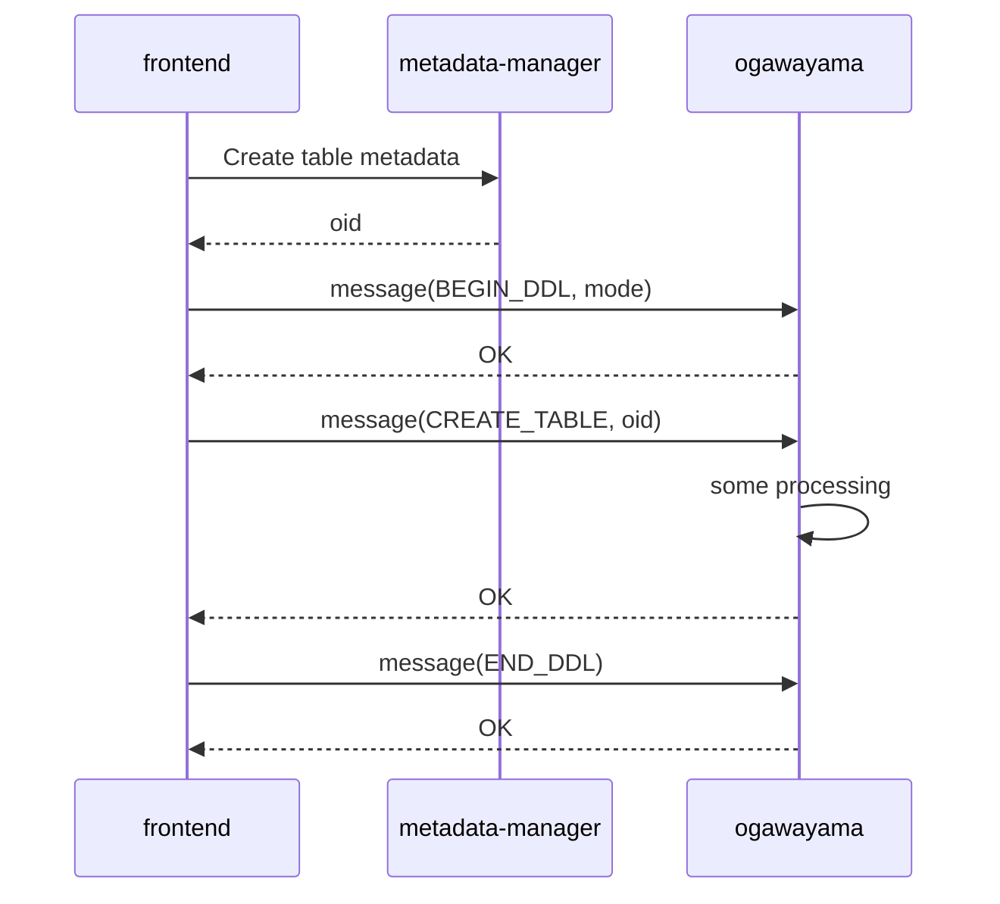
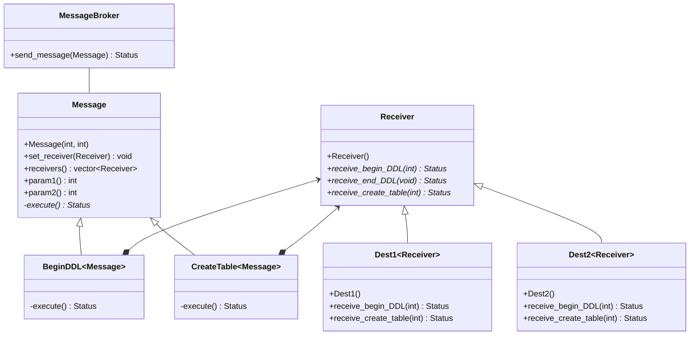

# Message Broker ドキュメント

2022.08.10 NEC

## 目的

Message Brokerは、メタデータ管理基盤（metadata-manager）上のデータを操作（作成/更新/削除）した場合に、関連モジュールに操作内容を通知するための仕組みである。



## 概要

メッセージ送信者はMessage派生クラス（CreateTableクラスなど）に以下の情報を設定する。メッセージパラメータ（param1, param2）はメッセージの種類によって意味合いが異なる。メッセージ送信者はMessageBrokerにMessageオブジェクトの送信を依頼する。

- 宛先情報 ※Receiver派生クラス（Dest1など）
- メッセージパラメータ（param1, param2）

Message Brokerは受け取ったMessageオブジェクトをメッセージ受信者に渡し、メッセージの種類ごとに（オーバーライドされた）メソッドが呼び出される（receive_create_tableなど）。

（クラス図）



## ヘッダファイル

```c++
frontend/message_broker/include/message/
message.h
receiver.h
message_broker.h
status.h
```

## メッセージ受信者の実装

メッセージ受信者は、Receiverクラスに記載されている仮想関数のうち、処理対象とする仮想関数についてオーバーライドし、必要な処理を記述する。なお、BEGIN_DDL/END_DDLのオーバライドは必須とする。

Receiver.h

```c++
class Receiver {
public:
  virtual Status receive_begin_ddl(int64_t mode) = 0;
  virtual Status receive_end_ddl() = 0;
  virtual Status receive_create_table(int64_t oid) { return status; }
  virtual Status receive_alter_table(int64_t oid) { return status; }
  virtual Status receive_drop_table(int64_t oid) { return status; }
}

```

DerivedReceiver.h

```c++
class DerivedReceiver : public Receiver {
public:
  Status receive_begin_ddl(int64_t mode) { ... }
  Status receive_end_ddl(int64_t oid) { ... }
  Status receive_drop_table(int64_t oid) { ... }
}

```

以上
