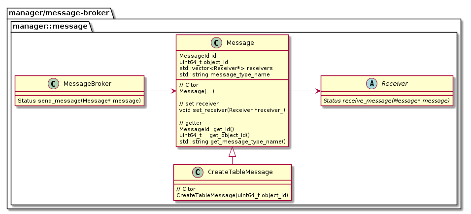
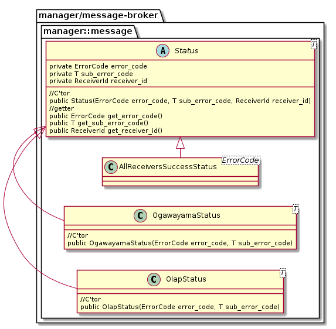

# message-broker API
## クラス図

## 用語
* 派生Receiver
  * Receiverクラスを継承するクラス

## 各クラスの説明
### MessageBroker
#### 説明
* メッセージを送信する。
#### メソッド
* Status send_message(Message* message)
  * 処理内容：Messageクラスにセットされたすべての派生Receiverに対して、receiver_message()メソッドでメッセージを送信する。
  * 条件
    * 事前条件：Messageクラスのすべてのフィールドがセットされている。
    * 事後条件：
      * 派生Receiverが返した概要エラーコードが「FAILURE」である場合、「FAILURE」が返ってきた時点で即座に、「FAILURE」を返した派生ReceiverのStatusを返す。
      * すべての派生Receiverが返したエラーコードが「SUCCESS」である場合、AllComponentsSuccessStatusを返す。
      * 詳細は[Statusクラス](#statusクラス)を参照。

### Message
#### 説明
* メッセージの内容、メッセージの受信者である派生Receiverリストを保持する。

#### フィールド
|フィールド名|説明|
|---|---|
|id|ユーザーが入力した構文を伝えるためのID|
|object_id|追加・更新・削除される対象のオブジェクトID 例）テーブルメタデータのオブジェクトID|
|receivers|メッセージの受信者である派生Receiverリスト。例）OltpReceiver、OlapReceiver|
|message_type_name|エラーメッセージ出力用の文字列　例）"CREATE TABLE"|

* id
  * ユーザーが入力した構文に応じて、各コンポーネントにその構文に対応するメッセージIDを伝える。
  * 型:列挙型(enum class)
    * 規定型:int
    * 次の通り管理する。
      * コンポーネント名：manager/message-broker
      * 名前空間：manager::message 
    * メッセージID一覧
      |メッセージID|ユーザーが入力した構文|
      |---|---|
      |CREATE_TABLE|CREATE TABLE構文|

#### メソッド
* void set_receiver(Receiver *receiver_)
  * メッセージの受信者である派生Receiverをセットする。

#### Message派生クラス一覧

|クラス名|ユーザーが入力した構文|
|---|---|
|CreateTableMessage|CREATE TABLE構文|

### Receiver
#### 説明
* メッセージを受信する。
#### メソッド
* Status receive_message(Message* message)
  * 処理内容：メッセージを受信して、派生Receiverはメッセージに対応する処理を実行、または、実行を指示する。
  * 条件
    * 事前条件：なし
    * 事後条件：
      * メッセージに対応する処理を実行後、派生Receiverは、Statusクラスのインスタンス(概要エラーコード・詳細エラーコード)を返す。
      * 詳細は[Statusクラス](#statusクラス)を参照。

### Status
#### 説明
* send_message()やreceive_message()の戻り値

#### クラス図
  

#### フィールド
* フィールド一覧

|フィールド名|説明|どのコンポーネントが管理するか|名前空間|
|---|---|---|---|
|error_code|概要エラーコード|manager/message-broker|manager::message|
|sub_error_code|詳細エラーコード|派生Receiver|派生Receiverで管理|
|component_id|コンポーネントID|manager/message-broker|manager::message|

* 概要エラーコードと対応する詳細エラーコード

|error_code|sub_error_code|
|---|---|
|SUCCESS|派生Receiverで管理される成功したときのエラーコード 例)ogawayama::stub::ErrorCode::OK|
|FAILURE|派生Receiverで管理される成功以外のエラーコード 例)ogawayama::stub::ErrorCode::UNKNOWN,ogawayama::stub::ErrorCode::SERVER_FAILUREなど|

* component_id
  * 派生Receiverを一意に特定するためID
  * 型:列挙型(enum class)
    * 規定型:int
    * コンポーネントID一覧
      |コンポーネントID|コンポーネント|
      |---|---|
      |ALL_COMPONENTS|すべてのコンポーネント|
      |OGAWAYAMA|ogawayama|
      |OLAP|olap|

#### AllComponentsSuccessStatus
* send_message()メソッドで返す戻り値。
* すべてのコンポーネントがreceiver_message()メソッドで返したエラーコードが「SUCCESS」である場合の戻り値。
* 各フィールドに格納される値
  |フィールド名| 値|
  |---|---|
  | error_code | SUCCESS | 
  | sub_error_code | SUCCESS |
  | component_id |  ALL_COMPONENTS |

#### OgawayamaStatus
* ogawayamaのstub::Transactionがreceiver_message()メソッドで返す戻り値
* 各フィールドに格納される値
  |フィールド名| 値|
  |---|---|
  | error_code | manager/message-brokerが管理する概要エラーコード | 
  | sub_error_code | 各コンポーネントが管理する詳細エラーコード |
  | component_id |  OGAWAYAMA |

#### OlapStatus
* OlapReceiverががreceiver_message()メソッドで返す戻り値
* 各フィールドに格納される値
  |フィールド名| 値|
  |---|---|
  | error_code | manager/message-brokerが管理する概要エラーコード | 
  | sub_error_code | 各コンポーネントが管理する詳細エラーコード |
  | component_id |  OLAP |
