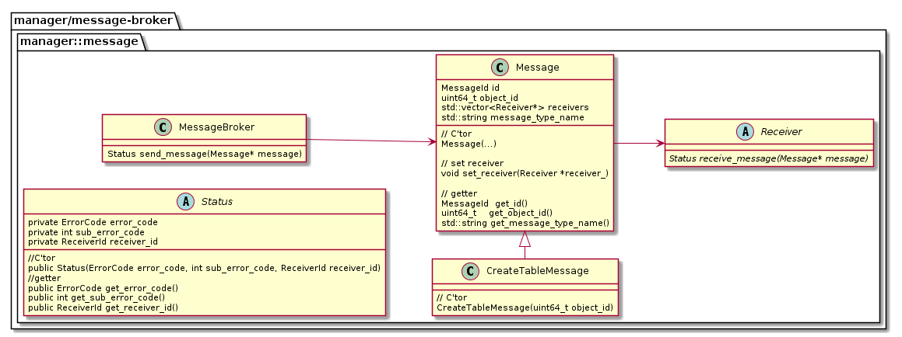

# message-broker API
2020.08.14 NEC

## 用語
* 派生Receiver
  * Receiverクラスを継承するクラス

## クラス図

## 各クラスの説明

### Status
#### 説明
* send_message()およびreceive_message()の戻り値

#### フィールド
* フィールド一覧

|フィールド名|説明|エラーコードを管理するリポジトリ名|エラーコードを管理する名前空間|
|---|---|---|---|
|error_code|概要エラーコード|manager/message-broker|manager::message|
|sub_error_code|詳細エラーコード|派生Receiverが配置されるリポジトリ|派生Receiverで管理|

|フィールド名|説明|派生ReceiverのIDを管理するリポジトリ名|派生ReceiverのIDを管理する名前空間|
|---|---|---|---|
|receiver_id|派生ReceiverのID|manager/message-broker|manager::message|

* 概要エラーコードと詳細エラーコードの対応表

|error_code|sub_error_code|
|---|---|
|SUCCESS|派生Receiverで管理される成功したときのエラーコードをint型にキャストした値。 例)(int)ogawayama::stub::ErrorCode::OK|
|FAILURE|派生Receiverで管理される成功以外のエラーコードをint型にキャストした値。 例)(int)ogawayama::stub::ErrorCode::UNKNOWN,(int)ogawayama::stub::ErrorCode::SERVER_FAILUREなど|

* receiver_id
  * 派生Receiverを一意に特定するためID
  * 型:列挙型(enum class)
    * 規定型:int
    * 派生ReceiverのID一覧
      |派生ReceiverのID|派生Receiver|
      |---|---|
      |ALL_RECEIVERS|すべての派生Receiver|
      |OGAWAYAMA|ogawayama|
      |OLAP|olap|

### MessageBroker
#### 説明
* メッセージを送信する。

#### メソッド
* Status send_message(Message* message)
  * 処理内容：MessageBrokerは、Messageクラスにセットされたすべての派生Receiverに対して、receive_message()メソッドでメッセージを送信する。
  * 条件
    * 事前条件：Messageクラスのすべてのフィールドがセットされている。
    * 事後条件：
      * 派生Receiverが返した概要エラーコードが「FAILURE」である場合、「FAILURE」が返ってきた時点で即座に、Statusクラスのインスタンスを返す。
      * すべての派生Receiverが返した概要エラーコードが「SUCCESS」である場合、Statusクラスのコンストラクタに次の値をセットして返す。
          |フィールド名| 値|
          |---|---|
          | error_code | SUCCESS | 
          | sub_error_code | (int)SUCCESS |
          | receiver_id |  ALL_RECEIVERS |
      * 詳細は[Status](#status)を参照。

### Message
#### 説明
* メッセージの内容、メッセージの受信者である派生Receiverリストを保持する。

#### フィールド
|フィールド名|説明|
|---|---|
|id|メッセージID。ユーザーが入力した構文に応じて、すべての派生Receiverにその構文を伝えるためID。|
|object_id|追加・更新・削除される対象のオブジェクトID 例）テーブルメタデータのオブジェクトID|
|receivers|メッセージの受信者である派生Receiverリスト。例）OltpReceiver、OlapReceiver|
|message_type_name|エラーメッセージ出力用の文字列　例）"CREATE TABLE"|

* id
  * 型:列挙型(enum class)
    * 規定型:int
    * 次の通り管理する。
      * リポジトリ名：manager/message-broker
      * 名前空間：manager::message 
    * メッセージID一覧
      |メッセージID|ユーザーが入力した構文|
      |---|---|
      |CREATE_TABLE|CREATE TABLE構文|

#### メソッド
* void set_receiver(Receiver *receiver_)
  * Messageクラスの派生Receiverリストに、派生Receiverをセットする。

#### Message派生クラス一覧

|クラス名|ユーザーが入力した構文|
|---|---|
|CreateTableMessage|CREATE TABLE構文|

### Receiver
#### 説明
* メッセージを受信する。
* 抽象クラス。

#### メソッド
* Status receive_message(Message* message)
  * 抽象メソッド。実際の処理は、派生Receiverが行う。
  * 処理内容：派生Receiverは、メッセージを受信して、メッセージに対応する処理の実行または、実行を指示する。
  * 条件
    * 事前条件：なし
    * 事後条件：
      * 派生Receiverは、メッセージに対応する処理を実行後、Statusクラスのインスタンスを生成する。このとき、コンストラクタで概要エラーコード・詳細エラーコードをセットする。生成したStatusクラスのインスタンスを返す。
      * 詳細は[Status](#status)を参照。

以上
