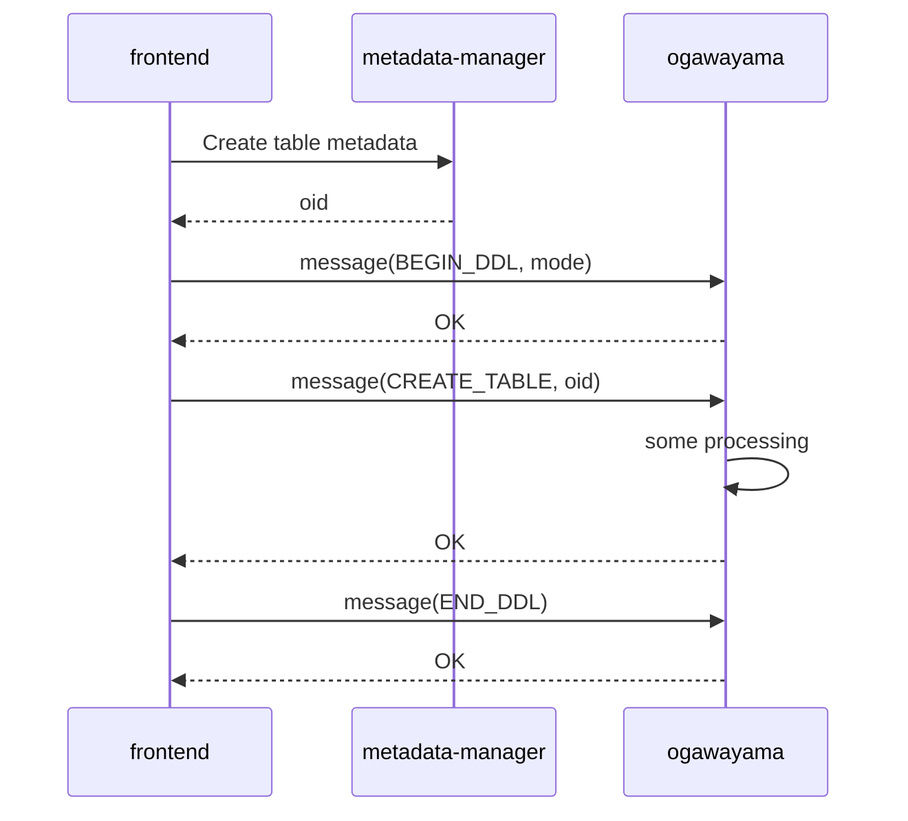
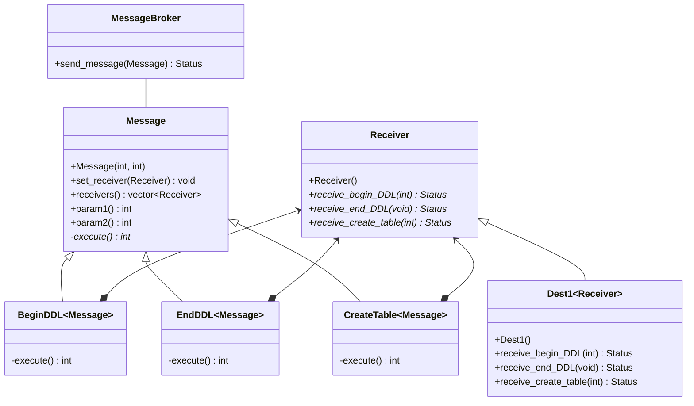

# Message Broker ドキュメント

2022.08.09 NEC

## 目的

Message Brokerは、メタデータ管理基盤（metadata-manager）上のデータを操作（作成/更新/削除）した場合に、関連モジュールに操作内容を通知するための仕組みである。



## 概要

送信者はMessage派生クラス（CreateTableクラスなど）に以下の情報を設定する。メッセージパラメータ（param1, param2）はメッセージの種類によって意味合いが異なる。送信者はMessageBrokerにMessageオブジェクトの送信を依頼する。

- 宛先情報 ※Receiver派生クラス（Dest1など）
- メッセージパラメータ（param1, param2）

Message Brokerは受け取ったMessageオブジェクトの種類ごとにオーバーライドされたメソッド（receive_create_tableなど）を呼び出す。

（クラス図）



## ヘッダファイル

```c++
frontend/message_broker/include/message/
message.h
receiver.h
message_broker.h
status.h
```

## 受信者の実装

受信者は、Receiverクラスに記載されている仮想関数のうち処理対象とする仮想関数について派生クラス上でオーバーライドし、必要な処理を記述する。

Receiver.h

```c++
class Receiver {
public:
  virtual bool receive_begin_ddl(uint64_t mode) = 0;
  virtual bool receive_end_ddl() = 0;
  virtual bool receive_create_table(uint64_t oid) { return true; }
  virtual bool receive_alter_table(uint64_t oid) { return true; }
  virtual bool receive_drop_table(uint64_t oid) { return true; }
}

```

DerivedReceiver.h

```c++
class DerivedReceiver : public Receiver {
public:
  bool receive_begin_ddl(uint64_t mode) { ... }
  bool receive_end_ddl(uint64_t oid) { ... }
  bool receive_drop_table(uint64_t oid) { ... }
}

```

※一部仕様を簡略化して記述

以上
